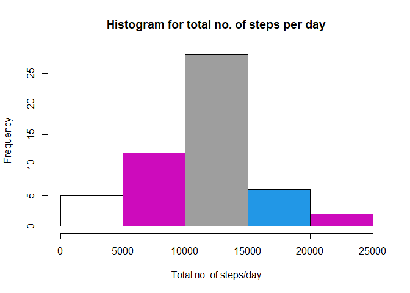
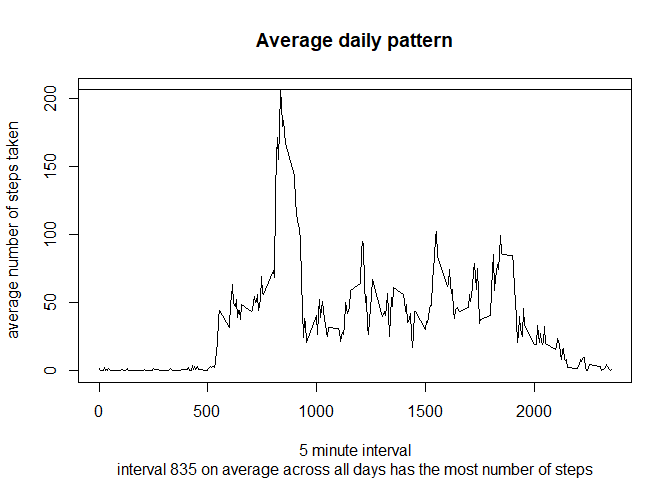
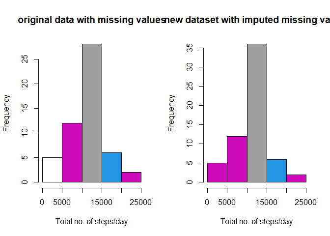
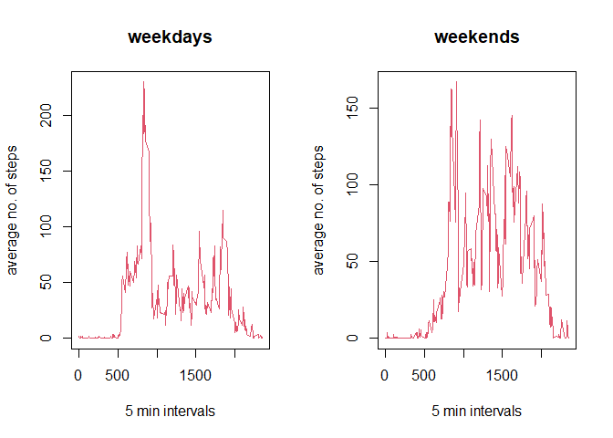

Assignment
================
Me
29/12/2020

**Reading the data into R.**

``` r
data<- read.csv('activity.csv')
head(data)
```

    ##   steps       date interval
    ## 1    NA 2012-10-01        0
    ## 2    NA 2012-10-01        5
    ## 3    NA 2012-10-01       10
    ## 4    NA 2012-10-01       15
    ## 5    NA 2012-10-01       20
    ## 6    NA 2012-10-01       25

Now we are preprocessing the data.

First we are changing the class of the date variable into date class
using the lubridate package.

``` r
library(lubridate)
```

    ## Warning: package 'lubridate' was built under R version 4.0.2

    ## 
    ## Attaching package: 'lubridate'

    ## The following objects are masked from 'package:base':
    ## 
    ##     date, intersect, setdiff, union

``` r
data$date<- ymd(data$date) #converting the date variable into date format
str(data)
```

    ## 'data.frame':    17568 obs. of  3 variables:
    ##  $ steps   : int  NA NA NA NA NA NA NA NA NA NA ...
    ##  $ date    : Date, format: "2012-10-01" "2012-10-01" ...
    ##  $ interval: int  0 5 10 15 20 25 30 35 40 45 ...

``` r
head(data)
```

    ##   steps       date interval
    ## 1    NA 2012-10-01        0
    ## 2    NA 2012-10-01        5
    ## 3    NA 2012-10-01       10
    ## 4    NA 2012-10-01       15
    ## 5    NA 2012-10-01       20
    ## 6    NA 2012-10-01       25

Finding sum of steps per day and turning it into a dataframe

``` r
x<-as.data.frame(tapply(data$steps, data$date, sum)) 
names(x)<- 'total_steps_per_day'
x$Date<- rownames(x)
```

Now plotting the histogram for total no. of steps per day

``` r
hist(x = x$total_steps_per_day, xlab = 'Total no. of steps/day', main = 'Histogram for total no. of steps per day', col = x$total_steps_per_day )
```

<!-- -->

Now showing the mean and median of total no. of steps/day

``` r
summary(x$total_steps_per_day)
```

    ##    Min. 1st Qu.  Median    Mean 3rd Qu.    Max.    NA's 
    ##      41    8841   10765   10766   13294   21194       8

*Finding average daily activity pattern and showing it in a plot*

Lets first remove the NA values from the data and keep it in a fresh
dataframe

``` r
data1<- data[complete.cases(data),] #removing NA values from the dataset and assigning it to new dataset 
head(data1)
```

    ##     steps       date interval
    ## 289     0 2012-10-02        0
    ## 290     0 2012-10-02        5
    ## 291     0 2012-10-02       10
    ## 292     0 2012-10-02       15
    ## 293     0 2012-10-02       20
    ## 294     0 2012-10-02       25

First finding the average/mean values and putting it into a dataframe
adp for convenience

``` r
adp<- as.data.frame(tapply(data1$steps, data1$interval, mean))
names(adp)<- 'Avg.daily.steps'
adp$intervals<- rownames(adp)
head(adp)
```

    ##    Avg.daily.steps intervals
    ## 0        1.7169811         0
    ## 5        0.3396226         5
    ## 10       0.1320755        10
    ## 15       0.1509434        15
    ## 20       0.0754717        20
    ## 25       2.0943396        25

Finding the 5 min interval which has the most no. of steps on average

``` r
max(adp$Avg.daily.steps) #finding the max of Avg.daily.steps
```

    ## [1] 206.1698

So 206.1698 is the maximum value of Avg.daily.steps. So now finding the
interval containing the max value of Avg.daily.steps i.e. 206.1698

``` r
adp[grep(206.1698, adp$Avg.daily.steps),]
```

    ##     Avg.daily.steps intervals
    ## 835        206.1698       835

now creating the graph

``` r
plot(adp$intervals, adp$Avg.daily.steps, xlab = '5 minute interval', ylab = 'average number of steps taken', type = 'l', main = 'Average daily pattern', sub = 'interval 835 on average across all days has the most number of steps')
abline(h = max(adp$Avg.daily.steps))
```

<!-- -->

*Imputing missing values and creating a new dataset* Finding number of
missing values in the original dataset

``` r
miss_value<- sum(is.na(data$steps))
```

Filling missing values with the average/mean value of total no. of steps
of that particular interval

``` r
data2<- data #copying the orginal dataframe 'data' into a new dataframe called 'data2'
#imputing missing or NA values with the mean no. of steps for that particular interval
for (i in 1:nrow(data2)){
  if(is.na(data2$steps[i])==TRUE){ #if missing value is found then the imputation is #done
    a<- data2$interval[i]
    b<- adp[adp$intervals==a,][1,1]
    data2$steps[i]<-b #replacing missing NA value with mean value
    a<-0 #initializing a= 0 for next iteration of the loop
    b<-0 #initializing b= 0 for next iteration of the loop
  }
}
head(data2) #now data2 has all NA values replaced by the mean of total no. of steps for that particular interval
```

    ##       steps       date interval
    ## 1 1.7169811 2012-10-01        0
    ## 2 0.3396226 2012-10-01        5
    ## 3 0.1320755 2012-10-01       10
    ## 4 0.1509434 2012-10-01       15
    ## 5 0.0754717 2012-10-01       20
    ## 6 2.0943396 2012-10-01       25

**Now making comparison of total no. of steps per day between the old
and new datasets i.e. data and data2** First finding the total no. of
steps taken and keeping it in a dataframe y

``` r
y<- as.data.frame(tapply(data2$steps, data2$date, sum)) 
names(y)<- 'total_steps_per_day'
y$Date<- rownames(y)
```

Showing summary stats i.e. mean and median for total no. of steps from
the new dataset

``` r
summary(y$total_steps_per_day)
```

    ##    Min. 1st Qu.  Median    Mean 3rd Qu.    Max. 
    ##      41    9819   10766   10766   12811   21194

Showing summary stats i.e. mean and median for total no. of steps from
the original dataset

``` r
summary(x$total_steps_per_day)
```

    ##    Min. 1st Qu.  Median    Mean 3rd Qu.    Max.    NA's 
    ##      41    8841   10765   10766   13294   21194       8

*so there is no change in mean and only a negligible impact on median.
However the 1st and 3rd quartile values have changed*

Now making 2 histograms in 2 panels showing differences in the total no.
of steps for the old and new datasets

``` r
par(mfrow= c(1,2))

hist(x = x$total_steps_per_day, xlab = 'Total no. of steps/day', main = 'original data with missing values', col = x$total_steps_per_day )
hist(x= y$total_steps_per_day, xlab = 'Total no. of steps/day', main = 'new dataset with imputed missing values', col = y$total_steps_per_day)
```

<!-- -->

Now checking for differences in activity patterns between weekdays and
weekends using data2

``` r
data2$weekday<- weekdays(data2$date) #finding the weekdays 
#now creating a factor variable that will show whether its a weekday or weekend
data2$weekday_factor<- data2$weekday %in% c('Monday','Tuesday', 'Wednesday','Thursday','Friday')
data2$weekday_factor<- as.factor(data2$weekday_factor)
```

Now separating this dataset into weekdays and weekends

``` r
weekdays<- data2[data2$weekday_factor==TRUE,]
weekends<- data2[data2$weekday_factor==FALSE,]
```

Now finding average no. of steps for all 5 min intervals for weekdays
and keeping it in a separate data frame for convenience.

``` r
weekdays_average<-  as.data.frame(tapply(weekdays$steps, weekdays$interval, mean))
names(weekdays_average)<- 'Avg.daily.steps'
weekdays_average$interval<- rownames(weekdays_average)
```

Now finding average no. of steps for all 5 min intervals for weekends
and keeping it in a separate data frame for convenience.

``` r
weekends_average<- as.data.frame(tapply(weekends$steps, weekends$interval, mean))
names(weekends_average)<- 'Avg.daily.steps'
weekends_average$interval<- rownames(weekends_average)
```

**now creating panel plot of 2 timeseries graphs of type ‘l’ for showing
differences in average number of steps taken, averaged across all
weekday days or weekend days (y-axis)**

``` r
par(mfrow= c(1,2))

plot(weekdays_average$interval, weekdays_average$Avg.daily.steps, type = 'l', xlab = '5 min intervals', ylab = 'average no. of steps', col= weekdays_average$Avg.daily.steps, main = 'weekdays')
plot(weekends_average$interval, weekends_average$Avg.daily.steps, type = 'l', xlab = '5 min intervals', ylab = 'average no. of steps', col= weekdays_average$Avg.daily.steps, main= 'weekends')
```

<!-- -->
